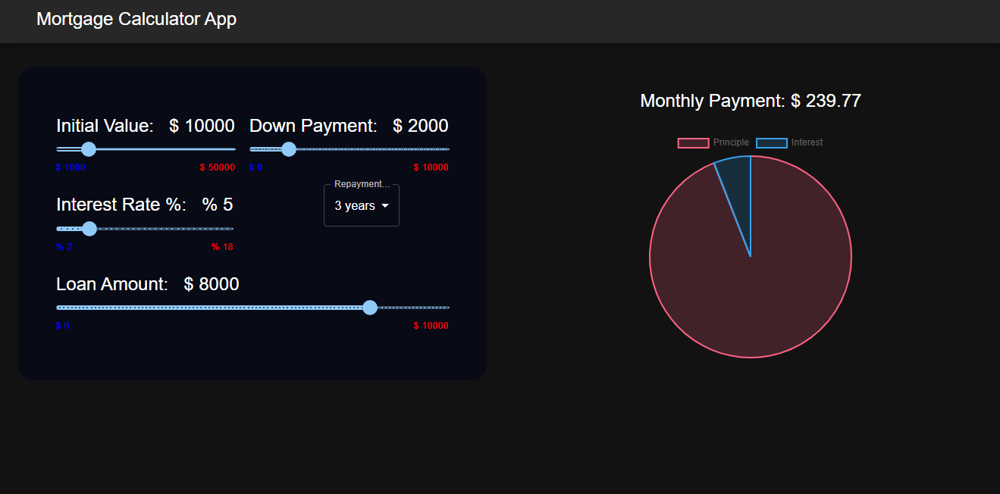

# Mortgage_Calculator

**Mortgage_Calculator** is a single web page created with React that allows you to calculate monthly EMI after taking out a loan.

## User Stories

The following functionalities are completed:

- [x] User can set the initial value of the loan.
- [x] User can set their down payment.
- [x] User can set the interest rate.
- [x] User can set the reapyment time.
- [x] User can set loan amount.
- [x] Monthly payment is displayed along with a pie chart.

## Demo

Here's a demo of implemented user stories:

## Live demo

[Mortgage calculator] (https://mortgage-calculator-whis99.vercel.app/)

## Open-source libraries used

- [React](https://react.dev/)
- [Npm](https://www.npmjs.com/)
- [Material-UI](https://mui.com/)
- [Chart.js](https://www.chartjs.org/)

## Available Scripts

In the project directory, you can run:

### `npm start`

Runs the app in the development mode.\
Open [http://localhost:3000](http://localhost:3000) to view it in your browser.

The page will reload when you make changes.\
You may also see any lint errors in the console.

### `npm test`

Launches the test runner in the interactive watch mode.\
See the section about [running tests](https://facebook.github.io/create-react-app/docs/running-tests) for more information.

### `npm run build`

Builds the app for production to the `build` folder.\
It correctly bundles React in production mode and optimizes the build for the best performance.
